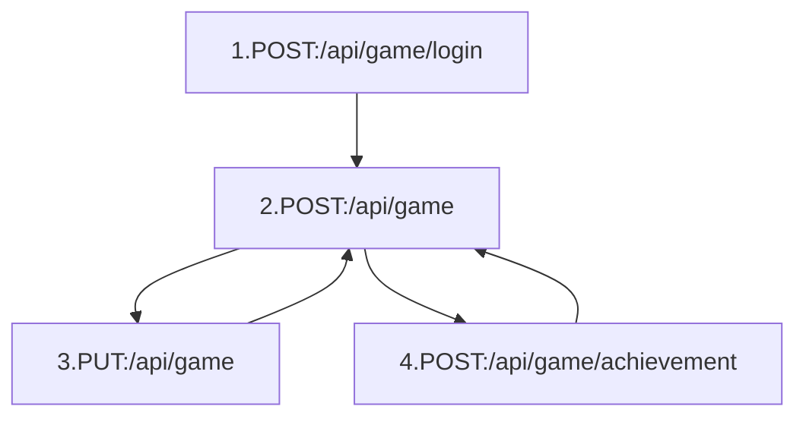

# Odin

## Goals

Make a simple Command and Control (C2) / Implant pair for self education and to use as a training tool.  Initially named
loki after a mech in the MechCommander franchise, I felt it better to just shift over to general norse mythology.

Further discussion at [https://khoward.net/2018/06/04/odin.html](https://khoward.net/2018/06/04/odin.html)

## Technologies

**Current**
  - C2 Server
    - [Python](https://www.python.org/)
    - [Pyramid (WebApp Framework)](https://trypyramid.com/)
    - [Cornice (REST Framework)](https://cornice.readthedocs.io/en/latest/)
    - [SQLAlchemy (ORM)](http://www.sqlalchemy.org/)
  - Implants
    - Raven
      - [Go](https://golang.org/)

**Future**
  - [Pyramid_Celery (Queues)](https://github.com/sontek/pyramid_celery)

## Key Elements

### Security
I want to bring this up front - as this is a learning and development environment I've not implemented much of the basic
security that you'd expect.  User endpoints are not secured, though the Raven test implant does do at least some key
exchange.  Again, this is not secure or production ready.  Let me know if you'd like it to be, but for my purposes this
is fine for now.

### C2 Server

This is an implant-agnostic system that implements a simple set of data models found in `odin/models`.  The endpoints
for raven are very generic and are located in `odin/views/raven.py`.  Raven's description follows this section, but the
gist on the C2 is that you can add new implant support by creating views in the `views` directory.  Not wanting to use
REST? See the `Future` section below.

### Implants

See the `implants` directory for source.  As this grows I may break them out into separate repos.

#### Raven

Raven is an implant written in [Go](https://golang.org) that allows command execution and file infil/exfil on a variety of platforms.
Theoretically this should be able to be a single binary on Android, iOS, and the list of operating systems at 
[golang/go/wiki](https://github.com/golang/go/wiki/MinimumRequirements).  This is a beaconing implant, developed in a
very short amount of time, with a lot more features coming.  Using the raven view in the C2, the execution flow is 
currently:



  1. `HTTP POST` Contact registration endpoint, provide a 'command hint' which should let users know what shell they
  have, get cuid and key
  2. `HTTP POST` Loop at beaconing interval and contact the taskboard with cuid and key for each loop.
  3. If a task or infil is given, execute the task, gathering STDIO along the way and killing the process at a given timeout.  `HTTP PUT` Results of the execution to the taskboard endpoint
  4. If an exfil is given, grab the file and `HTTP POST` to file result handler endpoint.
  5. For both 3 and 4, continue loop at 2
  
Future features of this include more reliability, actually testing across different 
platforms, a semi-interactive web shell (think of those old PHP shells), etc.  My personal goal is to provide a web
shell interface to each individual endpoint.

### Future
At some point I'll setup a bastion host that will handle boundary comms to keep the C2 on a private network and allow
for esoteric communication channels.
  
# Running
Below is a quick run through which should get your C2 up and running.

```
- Change directory into your newly created project.
    cd odin
- Create a Python virtual environment.
    which python3 #Output: /path/to/python3
    mkvirtualenv --python=/path/to/python3 odin
- Upgrade packaging tools.
    env/bin/pip install --upgrade pip setuptools
- Install dependencies
    env/bin/python setup.py develop
- Configure the database.
    env/bin/initialize_odin_db etc/development.ini
- Run your project's tests. (Future, use Postman for manual testing, 
  see loki.postman_collection.json)
    env/bin/pytest
- Run your project.
    env/bin/pserve etc/development.ini
```

# Driving Thoughts
  - Keep things obscure.  API can be something like `/api/game/implantcodename`
  - Don't just use an ORM and hope for the best. Secure and validate all endpoints.

# Notes

### Queueing
In the case of needing queueing these notes are helpful.  I'm changing from using a queue as primary mechanism to using
DB entries via models for tasking and such. Queuing should be setup for the listening post component.

  - Run `rabbitmq-server` (feel free to run in the background with `rabbitmq-server -detatched`)
  - Configure RabbitMQ
    - $ rabbitmqctl add_user myuser mypassword
    - $ rabbitmqctl add_vhost myvhost
    - $ rabbitmqctl set_user_tags myuser mytag
    - $ rabbitmqctl set_permissions -p myvhost myuser ".*" ".*" ".*"
  - Never outright kill the server, just use `rabbitmqctl stop` to gracefully stop the server.
  - Management console at http://localhost:15672/#/  with guest:guest for local attachments
  - Fire up `celery worker -A odin.tasks -E --ini development.ini` to run the worker.

#### Development Notes
  
  - When calling a task, you must use `method.delay(params)` instead of the usual `method.params()`
  - Parameters sent to a task must be JSON serializable (see https://docs.python.org/3/library/json.html)
